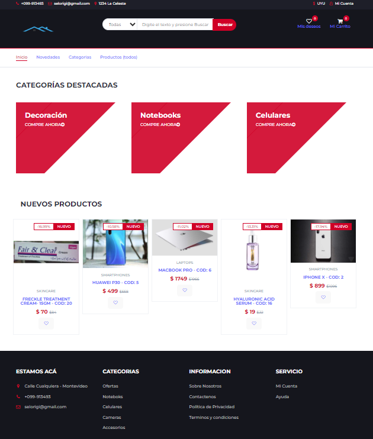
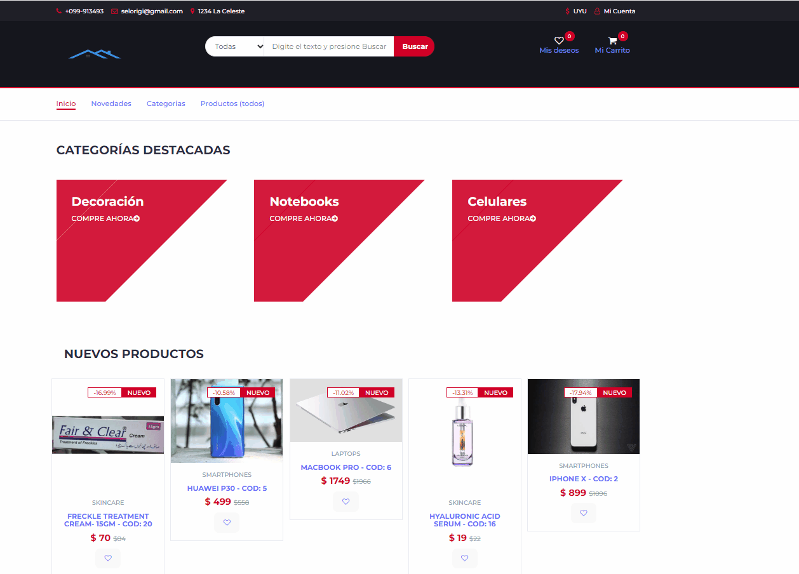

# Proyecto carrito con React - Instituto IBEC

Este proyecto hace parte de una entrega inicial del curso de React. Algunas de las premisas básicas era comprender los principales componentes inteligentes, utilizar los principales hooks, usar enrutamiento, aplicar renderizado condicional y manejo de eventos.

A propuesta del profesor Josué Oroya [@joshuacba08](https://twitter.com/joshuacba08) integramos en forma primaria Firebase.

Las secciones:

Header: con un buscador y un contador de "favoritos" y carrito de compras

Banner: con un navegador a distintas secciones

Categorías destacadas: configurable desde Firebase. Se le indica desde la base de datos qué categorías se quiere destacar. La página está configurada para mostrar 3 pero podrían indicarse más.

Nuevos Productos: configurable desde Firebase. Al igual que el apartado anterior está pensado en el deseo de destacar ciertos productos durante el tiempo deseado.

A continuación una captura de la pantalla principal con las secciones indicadas:

A continuación un pequeño gif que muestra el proceso de compra:

La idea es ir profundizando y perfeccionando esta primera entrega.
